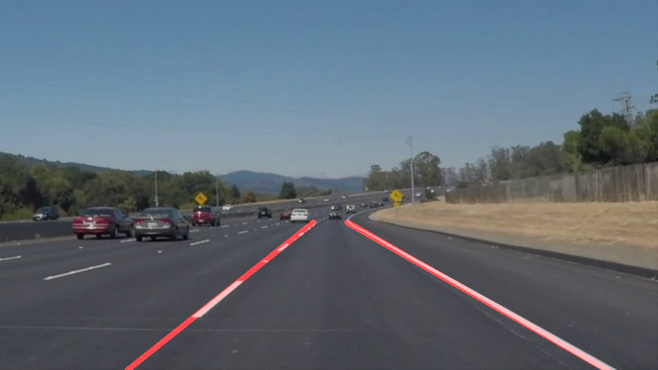

# **Finding Lane Lines on the Road** 
by Hanbyul Yang, July 18, 2017

## Overview

This is the first project of Self-Driving Car Nanodegree Program of Udacity.

In this project I will detect lane lines in given images and videos.
For the codes, Check `P1.ipynd` file.

## Reflection

### 1. Pipeline and Improving `draw_lines()` function

My pipeline consisted of 6 steps.

1. Grayscale the input image.

2. Blur the image for the good result of edge detection.

3. Extract edges from blurred image.

4. Mask edges with region of interest that has shape of trapezoid.

5. Get lane lines using Hough transform.

6. Finally, draw detected lane lines to original image.

In order to draw a single line on the left and right lanes, I modified the `draw_lines()` function. 
First, I divided lines using `hough_lines()` by their sign of slope. So, if slope is positive, the line is for right lane and negative slope means left lane. There are `y_min` and `y_max` values that are used for masking edges. Using slope and y-intercept that are calculated by `numpy.polyfit()`, two points that correspond to `y_min` and `y_max` can be found per line. By averaging that points of all lines, averaged two x and y coordinate are calculated for both left and right lane. 

Some exception are handled by manually, such as x coordinate of all points must in range of image width and each points of left and right lane must be in each half image.

### 2. Potential shortcomings with current pipeline
I can find shortcomings of current pipeline on testing optional challenge.

One potential shortcoming would be what would happen when the image has strong shades, Such as trees and central reservations.

Another potential shortcoming could be lack of robustness on changing color of road.

### 3. Possible improvements to pipeline

A possible improvement would be to use some previous detected lane line result. Temporal averaging of lane helps smooth movement of lane. Using previous result may help to detect challenging case by assumption that lane can't move in short period time.
